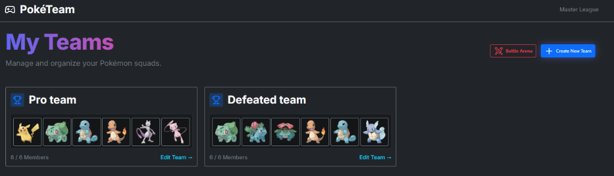
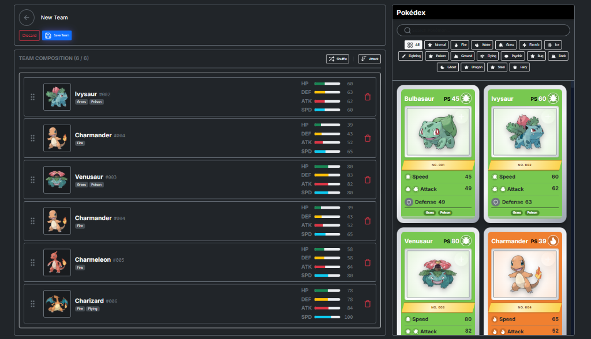
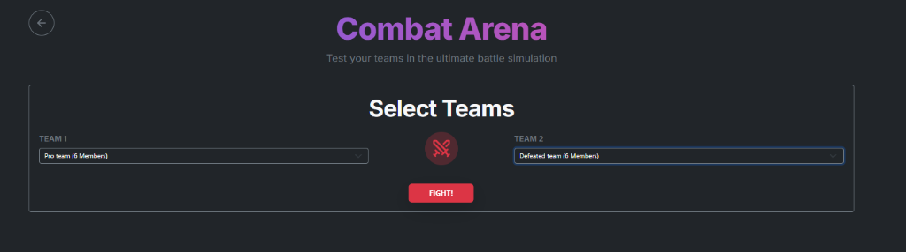
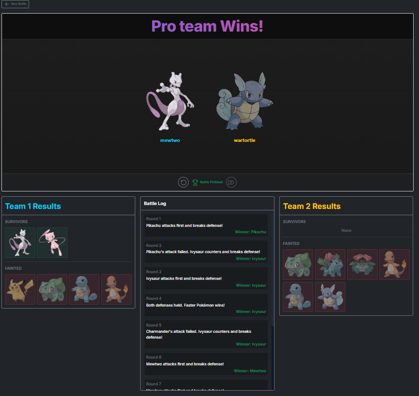

# 🎮 Pokémon Team Builder & Battle Arena

Bienvenido a la aplicación definitiva para crear equipos Pokémon y simular combates épicos. Este proyecto ha sido construido utilizando tecnologías modernas de React para ofrecer una experiencia fluida, robusta y escalable.

---

## 🚀 1. Instalación y Ejecución

Sigue estos pasos para levantar el proyecto en tu entorno local:

### Prerrequisitos

- **Node.js**: Asegúrate de tener instalado Node.js (versión 16 o superior recomendada).
- **npm**: El gestor de paquetes incluido con Node.js.

### Pasos

1.  **Clonar el repositorio** (si aplica) o descargar el código fuente.
2.  **Instalar dependencias**: Ejecuta el siguiente comando en la raíz del proyecto para descargar todas las librerías necesarias:
    ```bash
    npm install
    ```
3.  **Iniciar el servidor de desarrollo**:
    ```bash
    npm run dev
    ```
4.  **Abrir en el navegador**: La aplicación estará disponible generalmente en `http://localhost:5173/` (o el puerto que indique la terminal).

### Comandos Adicionales

- `npm test`: Ejecuta la suite de pruebas unitarias (Jest) para verificar la lógica de combate y componentes.

---

## 🛠️ 2. Librerías y Dependencias

Este proyecto utiliza una selección cuidadosa de herramientas para garantizar rendimiento, mantenibilidad y buenas prácticas.

| Categoría               | Librería                   | ¿Por qué se usa?                                                                                                                         | Dónde se usa                                              |
| :---------------------- | :------------------------- | :--------------------------------------------------------------------------------------------------------------------------------------- | :-------------------------------------------------------- |
| **Core**                | `react` / `react-dom`      | Es la base de la interfaz de usuario, permitiendo componentes reutilizables y gestión de estado reactiva.                                | Todo el proyecto.                                         |
| **Enrutamiento**        | `react-router-dom`         | Gestiona la navegación entre páginas (Home, Editor, Combat) sin recargar el navegador (SPA).                                             | `src/App.jsx` y navegación global.                        |
| **Estado Extero (API)** | `@tanstack/react-query`    | Maneja el caché, reintentos y estados de carga de las peticiones a la PokéAPI. Evita "prop drilling" de datos y optimiza el rendimiento. | `usePokemonQuery` para listas y búsquedas.                |
| **Estado Global**       | `zustand`                  | Gestiona el estado de la aplicación (equipos, borrador actual) de forma simple y ligera, sin la complejidad de Redux.                    | `src/store/useStore.js`, compartido entre Editor y Home.  |
| **Drag & Drop**         | `@dnd-kit/core`            | Permite la funcionalidad de arrastrar y soltar Pokémon para crear equipos o reordenarlos.                                                | `Pokedex.jsx` (origen) y `TeamEditor.jsx` (destino).      |
| **Peticiones HTTP**     | `axios`                    | Facilita la comunicación con la PokéAPI, manejando transformaciones de JSON automáticamente.                                             | `pokemon.service.js`.                                     |
| **Estilos**             | `sass` / `bootstrap`       | `Sass` para estilos modulares y `Bootstrap` para utilidades de grid y layout rápido.                                                     | Archivos `.scss` y clases de utilidad en JSX.             |
| **Iconos**              | `lucide-react`             | Proporciona una colección de iconos SVG limpios y consistentes, esenciales para una UI moderna y visualmente atractiva.                  | Botones, indicadores y elementos visuales en toda la app. |
| **Testing**             | `jest` / `testing-library` | Asegura que la lógica de combate y los componentes críticos funcionan correctamente.                                                     | `tests/`.                                                 |

### Apuntes para TanStackQuery

```text
Available properties from useQuery:
- data: The data returned from the query
- error: The error object (if any)
- isPending: True if there's no data yet (loading state)
- isError: True if the query encountered an error
- isLoading: Alias for isPending (in v4) / derived state
- isSuccess: True if the query fetched successfully
- status: 'pending' | 'error' | 'success'
- fetchStatus: 'fetching' | 'paused' | 'idle'
- isFetching: True whenever the query is requesting data (includes background refetches)
- isRefetching: True specifically when refetching
- refetch: Function to manually trigger a refetch
- dataUpdatedAt: Timestamp of last successful fetch
- errorUpdatedAt: Timestamp of last error
- failureCount: Number of failed attempts
- failureReason: The error that caused the failure
- isPlaceholderData: True if showing placeholder data
- isStale: True if data is considered stale
```

---

## 📖 3. Guía de Uso

### 🏠 Inicio (Home)

Tu panel de control. Aquí puedes ver tus equipos guardados y gestionar tus borradores.

- **Crear nuevo equipo**: Haz clic en el botón `+` para ir al Editor.
- **Ir a combate**: Usa el botón de espadas para ir a la Arena.



### 📝 Editor de Equipos

El corazón de la aplicación. Aquí construyes tu escuadrón perfecto.


1.  **Pokédex (Derecha)**: Busca Pokémon por nombre o filtra por tipo.
2.  **Arrastrar y Soltar**: Arrastra cualquier Pokémon desde la lista de la derecha hacia tu equipo en la izquierda.
3.  **Organizar**: Puedes reordenar los miembros de tu equipo arrastrándolos, de forma aleatoria, o de mayor a menor ataque.
4.  **Guardar**: Una vez tengas tu equipo listo (hasta 6 Pokémon), guárdalo para usarlo en batalla.

### ⚔️ Arena de Combate

¡Pon a prueba tu equipo!


1.  **Selección**: Elige dos equipos para enfrentarse. Es necesario tener al menos 1 pokemon en cada equipo para iniciar el combate.
2.  **Simulación**: El sistema simulará el combate turno por turno basándose en velocidad, ataque y defensa.
3.  **Resultados**: Verás un log detallado de cada ronda y una pantalla final con el ganador y los supervivientes.


